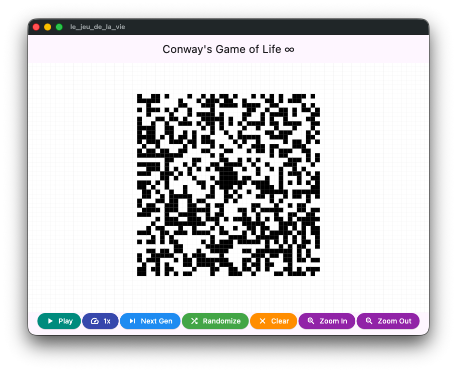
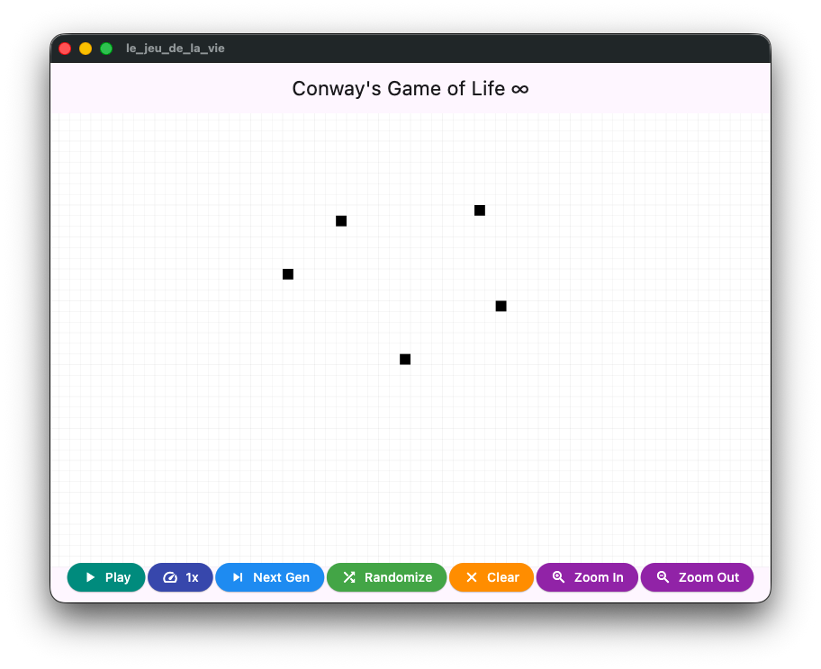

# Conway's Game of Life ∞

A Flutter implementation of Conway's Game of Life built with the [Flame](https://flame-engine.org/) game engine. Features an infinite, pannable and zoomable grid with full simulation controls.

---

## Screenshots

> 📸 Replace the placeholders below with your own screenshots.
> To take them: run the app on an emulator or device, press the screenshot button, then add the images to an `assets/screenshots/` folder in your repo.

|               Random Start               |                Drawing Mode                |             Running Simulation             |
| :--------------------------------------: | :----------------------------------------: | :----------------------------------------: |
|  |  |  |
|      Tap Randomize to seed the grid      |    Tap any cell to toggle it alive/dead    |        Hit Play and watch it evolve        |

---

## Features

- **Infinite grid** — pan in any direction forever, the grid has no bounds
- **Tap to toggle** — tap any cell to make it alive or dead
- **Drag to pan** — drag the grid to explore any area
- **Zoom in / out** — pinch or use the buttons to zoom between 0.2x and 5x
- **Manual stepping** — press Next Gen to advance one generation at a time
- **Continuous simulation** — press Play to run the simulation automatically
- **5 speed settings** — cycle through 1x, 2x, 5x, 20x and 100x speed
- **Randomize** — seed a 40×40 region with random live cells
- **Clear** — wipe the board to draw your own patterns from scratch

---

## How It Works

The grid is represented as a `HashSet<CellPos>` — only **alive** cells are stored in memory. Dead cells are represented by their absence from the set, which means the grid is truly infinite and memory usage scales with the population, not the grid area.

Each generation is computed in two passes:

1. Every alive cell casts a "vote" onto each of its 8 neighbors, building a neighbor-count map
2. Conway's rules are applied to every candidate cell in the map

```
Survive:  live cell with 2 or 3 neighbors
Born:     dead cell with exactly 3 neighbors
Die:      everything else
```

---

## Getting Started

### Prerequisites

- Flutter SDK `>=3.0.0`
- Dart SDK `>=3.0.0`

### Dependencies

```yaml
dependencies:
  flutter:
    sdk: flutter
  flame: ^1.18.0
  equatable: ^2.0.5
```

### Run

```bash
git clone https://github.com/YOUR_USERNAME/game-of-life.git
cd game-of-life
flutter pub get
flutter run
```

---

## Controls

| Button           | Action                                  |
| ---------------- | --------------------------------------- |
| **Next Gen**     | Advance one generation manually         |
| **Play / Pause** | Start or stop the automatic simulation  |
| **Speed**        | Cycle through 1x → 2x → 5x → 20x → 100x |
| **Randomize**    | Fill a 40×40 region with random cells   |
| **Clear**        | Kill all cells                          |
| **Zoom In**      | Zoom in (max 5x)                        |
| **Zoom Out**     | Zoom out (min 0.2x)                     |
| **Drag**         | Pan the infinite grid                   |
| **Tap cell**     | Toggle a cell alive or dead             |

---

## Project Structure

```
lib/
├── main.dart
└── game/
    ├── cell_pos.dart        # Value-equality cell coordinate
    ├── infinite_grid.dart   # Sparse HashSet grid + Conway logic
    ├── game_of_life_game.dart  # Flame game, input & camera
    └── game_of_life_widget.dart # Flutter UI and buttons
```

---

## Download

👉 **[Download latest APK](../../releases/latest)**

---

## License

MIT
